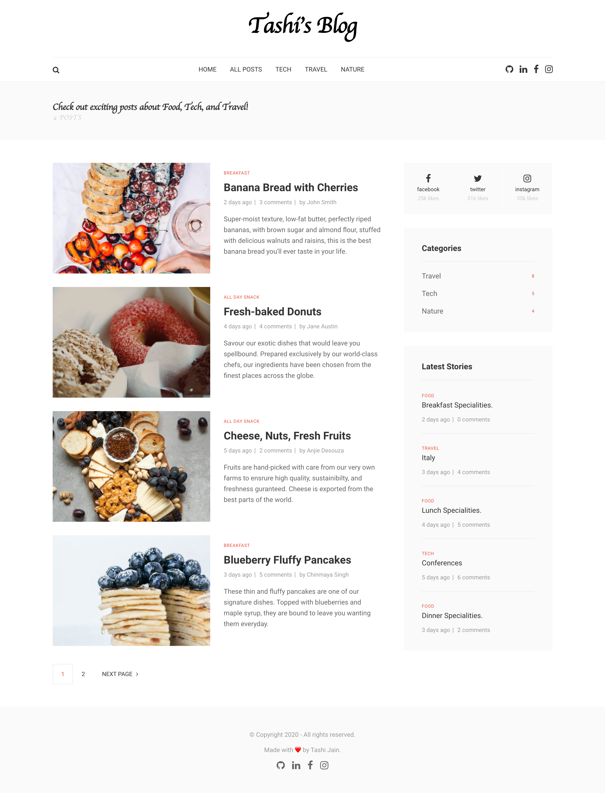
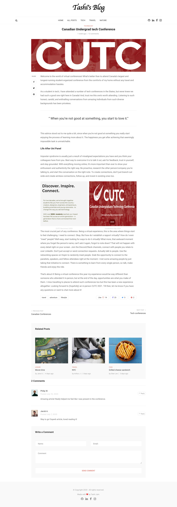

# Tashi's Blog Website

Blog Website(only client-side/front-end) converted from purely HTML and CSS to a fully functioning React application.

## Features

- Header and Footer on every single page
- Error 404 page if the user navigates to a wrong URL
- Links to Social Media for each author for each article
- Navbar: Home page, All posts page, Tech, Nature, and Travel specific pages

### Tech Stack used:

- React, React Router (DOM), CSS

